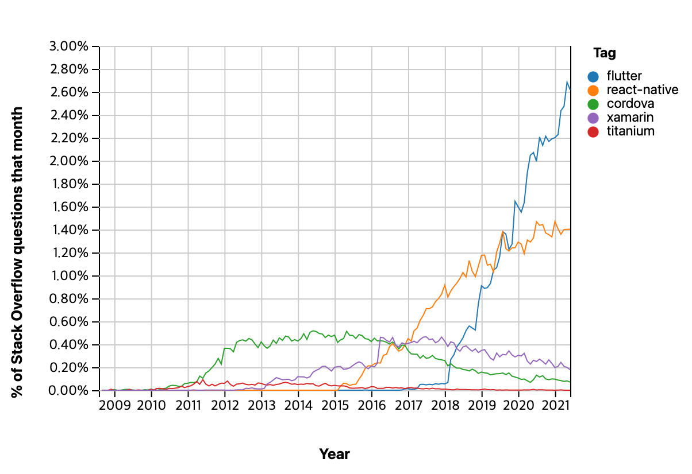
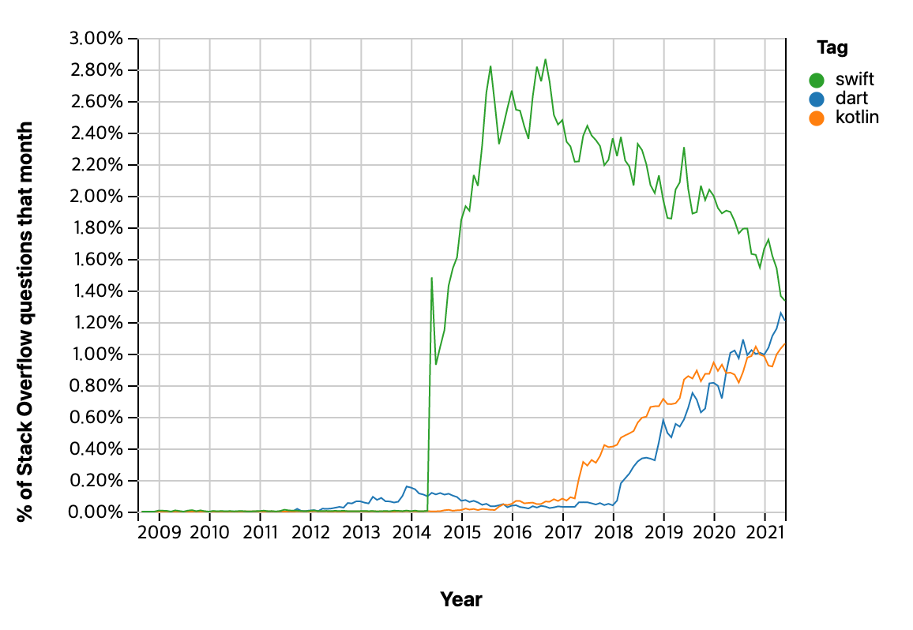
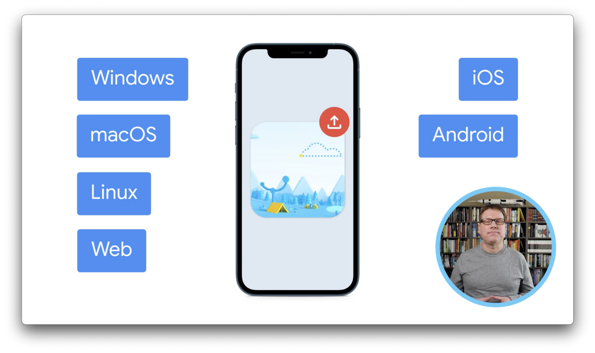
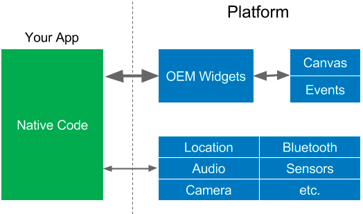
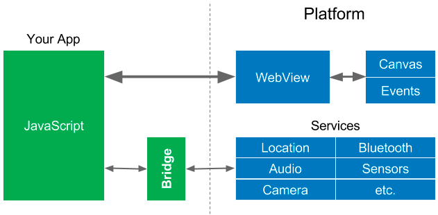
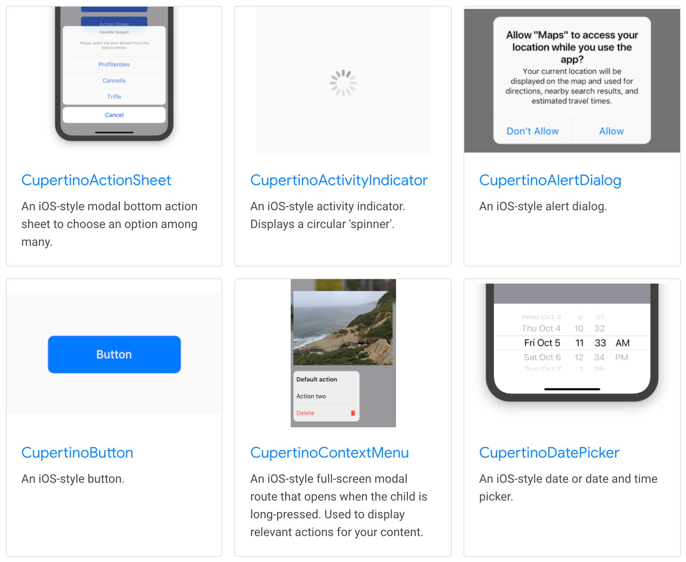
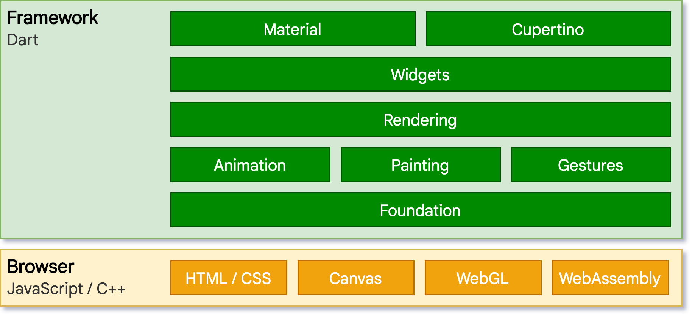
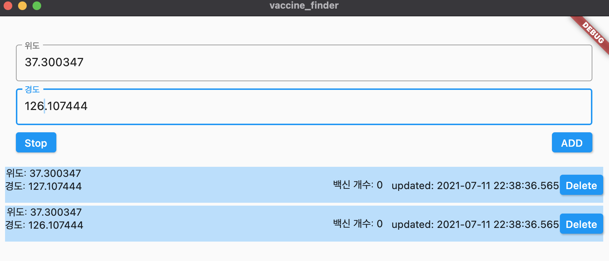

# Flutter 그리고 Web & Desktop
1. Flutter - Beautiful native apps in record time
2. Trend현황
3. Flutter2
4. Architecture
5. Material, Cupertino design
6. Flutter Web
7. Flutter Desktop


# Flutter - Beautiful native apps in record time
[Flutter 공식 개발자 페이지](flutter.dev) 의 제목이 Beautiful native apps in record time 입니다.  이 제목과 같이 Flutter는 네이티브로 빠르게 동작하는 아름다운 앱을 개발할 수 있는 UI 툴킷 입니다. 
구글에서 만들었고 지원하고 있으며,  구글의 차세대 OS인 퓨시아용 앱 개발의 주된 방식으로 사용됩니다.

> Flutter is Google’s UI toolkit for building beautiful, natively compiled applications for  [mobile](https://flutter.dev/docs) ,  [web](https://flutter.dev/web) ,  [desktop](https://flutter.dev/desktop) , and  [embedded](https://flutter.dev/embedded)  devices from a single codebase.  

* 공식 사이트에서는 Flutter를 toolkit으로 칭하고 있습니다.
좀 더 크로스 플랫폼의 앱을 개발하는데 초점이 가 있기 때문이 아닌가 싶습니다.


# Trend 현황
Flutter 의 관심도는 나날이 높아지고 있습니다. eos가 많은 google이기 때문에 초반에 많은 걱정이 있었지만, 계속 발전해 나갈것으로 보입니다.

Stack Overflow Trends를 보면


Cross-Platform중에서는 급속도로 성장하여 react-native를 제친지 오래되었습니다.
([Link](https://insights.stackoverflow.com/trends?tags=flutter%2Creact-native%2Ccordova%2Ctitanium%2Cxamarin%2Cionic%2Celectron))



최악의 언어로 꼽힌 dart도 Flutter 개발에 사용된 이후에 급속도로 성장하게 되었습니다.
([Link](https://insights.stackoverflow.com/trends?tags=dart%2Ckotlin%2Cswift))

Cross-Platform 개발시에는 많은 선택사항들이 있습니다. 그동안 react-native 가 주 옵션이지만 Flutter2 이후부터는 Flutter가 주 선택사항으로 자리매김 하지 않을까 합니다.


# Flutter2
업데이트를 거듭하며 Flutter2를 기점으로 인상적인 변화가 있었습니다.
이전까지 stable 채널에서는 오직 Android와 iOS만을 지원했었습니다.

- Mobile Framework -> Portable Framework
최적화가 이루어져서 드디어 Web이 Stable 채널에서 지원하게 되었고, 데스크탑 앱(리눅스, 맥, 윈도우), 임베디드 기기까지 지원하게 되었습니다.

다양한 플랫폼에 대하여 [gskinner: leaders in Flutter design and development](https://flutter.gskinner.com/)를 통해 좀 더 살펴볼 수 있습니다.

# Architecture

- 아래 레이어에 대해서 접근권한이 없으며, Framework 레벨의 모든부분은 선택사항이며, 대체 가능하도록 설계되었습니다.

## Flutter Engine
위 Architecture에서 core 부분인 Engine은 c++로 구현되어 있습니다. dart 언어로 추상화 되어있고, dart:ui로 감싸져 있습니다. 
엔진은 UI의 scene들을 display에 표현(rasterizing)합니다. 기존 크로스 플랫폼 프레임워크와는 다르게 각 시스템이 제공하는 컨트롤(웹뷰등)을 사용하지 않고 직접 그리기 때문에([Skia](https://skia.org/)사용) native app과 같은 경험을 제공합니다.

## Skia
2005년에 구글에 인수되어 2008년에 오픈소스로 출시된 2D 그래픽 라이브러리 입니다. 크롬, 안드로이드, 플러터, 파이어폭스의 그래픽 엔진으로 사용되있습니다.
Flutter는 각 디바이스의 Native Component를 사용하지 않고 Skia를 통해 widget을 직접 그리기 때문에 플랫폼이 달라지더라도 동일한 모습을 나타낼 수 있습니다.


<OEM SDKs>

전통적인 App들은 위의 모습과 같은 형태를 갖습니다. Platform에서 제공하는 위젯으로 구현하기 때문에 Platform에 종속적이지만 그만큼 최적화가 잘 되어 있어 매끄러운 화면을 제공합니다.


<WebViews>

OEM SDKs로 App들을 개발하려면 각 Platform별로 개발을 해야 되기 때문에 자원이 많이 필요합니다. 따라서 좀 더 효율적인 개발을 위해 각 Platform에서 제공하는 WebView를 활용하여 html과 javascript로 Cross Platform 개발을 하는 방법이 있습니다.
단순한 기능을 구현할때에는 Platform에 종속적인 코드가 최소화 되지만 Device의 기능들을 사용하려면 Bridge가 필요합니다. 또한 보안등의 문제로 native 코드가 추가로 필요할 수 있습니다.
WebView의 렌더링 엔진에 따라 최적화가 달라지게 되며, Platform별로 다른 WebView로 동일한 화면을 제공하지 못할 수 있습니다. 또한 WebView에서 다시 렌더링이 이루어 지고, html렌더링이 native방식보다 빠르지 못해 위의 OEM SDKs 방법보다 속도가 떨어집니다. 
두 방식의 장점을 취하기 위해 속도가 중요하지 않는 부분은 WebView로 개발하여 두 방식을 혼합하여 개발하기도 합니다.


<Reactive Views>

React Native는 Platform별로 Bridge를 제공하기 때문에 개발자는 Reactive View를 구현하여 Cross Platform 개발을 좀 더 편하게 만들게 합니다. Bridge를 통해 OEM Widgets을 사용하게 되기 때문에 제공되는 Widget의 자유도가 높지 않으며, Bridge접속이 늘어날 경우 성능상의 문제가 발생하기도 합니다.

- Native 기능을 쓰려면 Framework에서 제공하지 않는 기능을 쓸 때가 많습니다. 그럴땐 결국 Bridge역할을 하는 코드들이 필요합니다. 결국 WebView, Reactive Views, Flutter개발을 할 때 native 개발이 필요할 수 있습니다.


<Flutter>

Flutter 또한 Reactive View를 제공하고 있지만 위에서 다룬 Flutter engine을 통해 각 Platform의 Widget을 거치지 않고 직접 Widget을 만들어 Platform별로 native로 컴파일됩니다. 따라서 Platform별로 좀 더 동일한 화면과 좀 더 최적화된 UI를 제공합니다.


# Material, Cupertino design
Flutter는 Android 방식의 Material design과 iOS방식의 Cupertino design을 모두 지원하며 각각의 widget으로 제공합니다.


<Cupertino Widget 예>

같은 Device에서 Material과 Cupertino 를 섞어서 사용하는것도 가능합니다.
(개발하다보면 결국 Material로 개발하게 됩니다.)

- [Flutter로 Cupertino 앱 빌드  |  Google Codelabs](https://codelabs.developers.google.com/codelabs/flutter-cupertino?hl=ko#0)


# Flutter Web
다른 플랫폼과는 다르게 Web을 지원하기 위해서는 몇가지 특징들이 필요했습니다.
다트는 예전부터 javascript로 컴파일 되어왔고, 구글 Ads ads 에도 실제로 사용되었습니다. 따라서 다트로 이루어진 Flutter가 자바스크립트로 컴파일되는 것은  간단했습니다.
하지만 C++로 구현되어있는 engine은 웹 브라우져 보다는 기본 운영체제에 맞춰 고안되었습니다. 따라서 다른 접근방식이 필요했으며, Flutter는 브라우저의 standard api에 맞는 새로운 engine을 구현하였습니다. 
HTML 또는 WebGL 두 방식으로 렌더링이 이루어집니다. HTML 모드에서는 HTML, CSS, Canvas, SVG를 사용하며, WebGL에서는 CanvasKit이라고 WebAssembly로 컴파일 된 Skia 를 사용합니다. HTML mode에서는 최적화된 코드 사이즈를 제공하며 WebGL 모드에서는 최적화된 그래픽 성능을 제공합니다.




다른 플랫폼과 다르게 Flutter는 Dart runtime이 필요하지 않으며, javascript로 컴파일됩니다. 

## Web Demo
- [Flutter Plasma](https://flutterplasma.dev/)
- [Flutter Web App Demo](http://minikin.me/flutter-web-demo/#/)
- [Flutter samples](https://flutter.github.io/samples/web_dashboard.html)


## 지원 시나리오
- A Progressive Web Application built with Flutter
- Single Page Application
- Existing mobile application
[YouTube](https://www.youtube.com/watch?v=HAstl_NkXl0&t=566s)

## Web페이지 안에서 사용하기
```
<iframe src="URL"></iframe>
```


# Flutter Desktop
- Ubuntu에서 차세대 데스크톱 설치 프로그램으로 Flutter 활용중
- Ubuntu의 경우 조만간 Flutter 설치프로그램을 사용하게 될 것이며, 표준환경 또한 Flutter로 지원 될 예정

현재 Stable branch에 Linux, Mac, Window 로 빌드할 수 있게 들어와 있습니다.  Web과는 다르게 매우 안정적인 모습을 보여주고 있어 조만간 많은 플랫폼에서 활용되지 않을까 합니다.



Mac OS 로 간단하게 잔여백신을 찾는 앱을 만들어봤습니다.(만들고 나서야 무의미한 일인것을 깨달았습니다ㅠㅠ) Android, iOS에서 동작하는 코드와 동일한 코드를 사용했지만, notification 같은 경우는 별도로 plugin으로 구현하였습니다. 현재 지원되고 있는 플랫폼은 개별 플러그인마다 한정적이라 디바이스 특화 기능을 사용하는데에는 추가 개발이 필요할것 같습니다.


#Flutter
